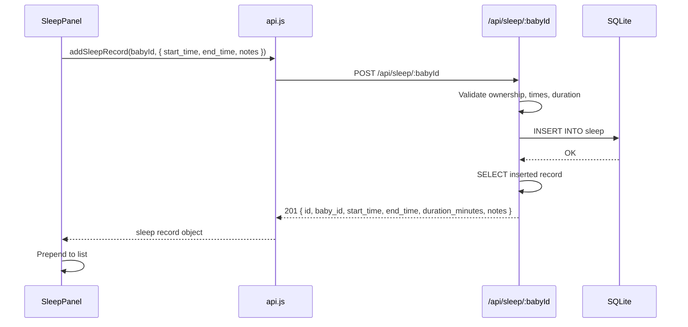
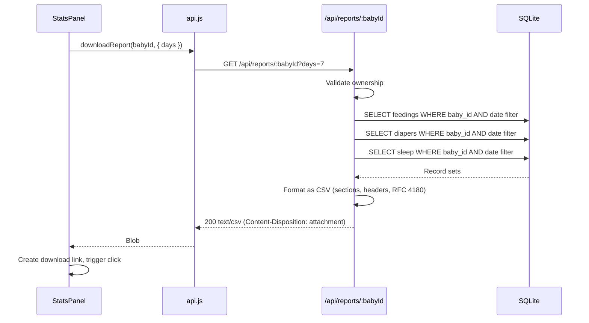

# Design Document: Report Download and Sleep Tracking

## Overview

This feature extends the Baby Tracker application with two capabilities:

1. **Sleep Tracking** — A full CRUD module for logging infant sleep sessions, including automatic duration calculation, an ongoing-session model, stats aggregation, and a dedicated UI panel.
2. **CSV Report Download** — A server-side report generator that produces RFC 4180-compliant CSV exports covering feedings, diapers, and sleep data, downloadable from the dashboard.

Both capabilities follow the existing architectural patterns: Express routes backed by SQLite via better-sqlite3 on the server, React components calling a shared `api.js` helper on the client.

## Architecture

The system follows the existing layered architecture:

```mermaid
graph TB
    subgraph Frontend [Client - React + Vite]
        Dashboard[Dashboard.jsx]
        SleepPanel[SleepPanel.jsx]
        StatsPanel[StatsPanel.jsx]
        API[api.js]
    end

    subgraph Backend [Server - Node.js + Express]
        SleepRoutes[/api/sleep]
        StatsRoutes[/api/stats]
        ReportRoutes[/api/reports]
        AuthMW[auth middleware]
        DB[SQLite - better-sqlite3]
    end

    Dashboard --> SleepPanel
    Dashboard --> StatsPanel
    SleepPanel --> API
    StatsPanel --> API
    API --> SleepRoutes
    API --> StatsRoutes
    API --> ReportRoutes
    SleepRoutes --> AuthMW
    StatsRoutes --> AuthMW
    ReportRoutes --> AuthMW
    AuthMW --> DB
```

### Key Design Decisions

1. **Single CSV file with sections** — Rather than separate endpoints per data type, one `/api/reports/:babyId` endpoint generates a consolidated CSV. This keeps the UI simple (one button) and gives pediatricians a single file.
2. **Duration computed server-side** — The server calculates `duration_minutes` on creation to ensure consistency regardless of client timezone handling.
3. **Ongoing sleep sessions** — Records with `null` end_time represent in-progress sessions. The client can PATCH to set the end time.
4. **Reuse of existing patterns** — UUID primary keys, `user_id` ownership checks, same auth middleware, same date filtering approach as feedings/diapers.

## Components and Interfaces

### Backend Routes

#### `/api/sleep` — Sleep CRUD

| Method | Path | Description |
|--------|------|-------------|
| GET | `/:babyId` | List sleep records (default 50, descending by start_time) |
| POST | `/:babyId` | Create a sleep record |
| PATCH | `/:babyId/:sleepId` | Update a sleep record (end an in-progress session) |
| DELETE | `/:babyId/:sleepId` | Delete a sleep record |

#### `/api/stats/sleep/:babyId` — Sleep Stats

| Method | Path | Description |
|--------|------|-------------|
| GET | `/:babyId` | Aggregated sleep stats for a time period |

Query params: `days` (integer), `from` (date), `to` (date) — same pattern as feeding/diaper stats.

#### `/api/reports/:babyId` — CSV Report

| Method | Path | Description |
|--------|------|-------------|
| GET | `/:babyId` | Download CSV report |

Query params: `days` (integer, optional — omit for full history).

### Frontend Components

#### `SleepPanel.jsx`
- Form for logging sleep sessions (start_time, end_time, notes)
- List of recent sleep records with duration display
- "In Progress" indicator for records without end_time
- "End Now" button to close an open session via PATCH

#### `StatsPanel.jsx` (modified)
- Add sleep stats cards (avg duration/day, total sessions)
- Add daily sleep breakdown table
- Add "Download Report" button with loading/error states

### API Helper Functions (additions to `api.js`)

```javascript
// Sleep
getSleepRecords(babyId)
addSleepRecord(babyId, data)
updateSleepRecord(babyId, sleepId, data)
deleteSleepRecord(babyId, sleepId)

// Sleep Stats
getSleepStats(babyId, { days, from, to })

// Reports
downloadReport(babyId, { days })  // returns blob
```

## Data Models

### Sleep Table Schema

```sql
CREATE TABLE IF NOT EXISTS sleep (
  id TEXT PRIMARY KEY,
  baby_id TEXT NOT NULL,
  user_id TEXT NOT NULL,
  start_time TEXT NOT NULL,
  end_time TEXT,
  duration_minutes INTEGER,
  notes TEXT,
  created_at TEXT DEFAULT (datetime('now')),
  FOREIGN KEY (baby_id) REFERENCES babies(id) ON DELETE CASCADE,
  FOREIGN KEY (user_id) REFERENCES users(id) ON DELETE CASCADE
);
```

**Field details:**
- `id` — UUID v4, generated server-side
- `start_time` — ISO 8601 datetime string (required)
- `end_time` — ISO 8601 datetime string (nullable for in-progress sessions)
- `duration_minutes` — Integer, computed as `Math.floor((end - start) / 60000)`, null when end_time is null
- `notes` — Free-text, max 500 characters, nullable

### Data Flow: Sleep Record Creation



### Data Flow: CSV Report Download



### CSV Output Structure

```
Section: Feedings
date,type,duration_minutes,quantity_ml,quantity_oz,side,notes
2024-01-15T10:30:00Z,breast,15,,,,
2024-01-15T08:00:00Z,formula,,120,4.1,,,

Section: Diapers
date,type,notes
2024-01-15T09:00:00Z,pee,

Section: Sleep
start_time,end_time,duration_minutes,notes
2024-01-15T20:00:00Z,2024-01-16T06:00:00Z,600,
```

## Correctness Properties

*A property is a characteristic or behavior that should hold true across all valid executions of a system — essentially, a formal statement about what the system should do. Properties serve as the bridge between human-readable specifications and machine-verifiable correctness guarantees.*

### Property 1: Sleep record creation round-trip

*For any* valid start_time/end_time pair (where end > start and duration ≤ 1440 minutes) and any notes string (0–500 characters), creating a sleep record and then retrieving it SHALL return a record where `duration_minutes === Math.floor((end_time - start_time) / 60000)` and `notes` equals the original input.

**Validates: Requirements 1.1, 1.3**

### Property 2: Invalid end time rejection

*For any* pair of timestamps where end_time ≤ start_time, submitting a sleep record SHALL be rejected with a validation error and the total count of sleep records SHALL remain unchanged.

**Validates: Requirements 1.2**

### Property 3: Maximum duration rejection

*For any* pair of timestamps where the difference exceeds 1440 minutes (24 hours), submitting a sleep record SHALL be rejected with a validation error and the total count of sleep records SHALL remain unchanged.

**Validates: Requirements 1.7**

### Property 4: Retrieval sort order invariant

*For any* set of sleep records belonging to a baby, the list returned by the GET endpoint SHALL be sorted in strictly descending order by start_time — i.e., for every adjacent pair (record[i], record[i+1]), record[i].start_time ≥ record[i+1].start_time.

**Validates: Requirements 2.1**

### Property 5: Sleep stats calculation correctness

*For any* set of sleep records within a date range spanning N days, the computed `average_minutes_per_day` SHALL equal `round(sum(all duration_minutes) / N, 1)` and the `total_sessions` SHALL equal the count of records, and the daily breakdown totals SHALL sum to the overall totals.

**Validates: Requirements 4.1, 4.2**

### Property 6: Timeframe filtering correctness

*For any* set of records and a given `days` parameter, the report SHALL include exactly those records whose timestamp falls within `[now - days*24h, now]` — no record outside the window is included, and no record inside the window is excluded.

**Validates: Requirements 5.1**

### Property 7: CSV structure integrity

*For any* non-empty set of feeding, diaper, and sleep records, the generated CSV SHALL contain exactly 3 section header rows (one per type), each followed by a column header row, with data rows sorted descending by timestamp within each section, and sections separated by exactly one empty row.

**Validates: Requirements 5.3**

### Property 8: RFC 4180 CSV encoding

*For any* string value containing commas, double quotes, or newline characters, the CSV_Generator SHALL produce output where that field is enclosed in double quotes and any internal double quotes are escaped by doubling them, such that parsing the CSV output with a compliant parser recovers the original value.

**Validates: Requirements 5.4**

## Error Handling

| Scenario | Response |
|----------|----------|
| Baby not found or unauthorized | 404 `{ error: "Baby not found" }` |
| end_time ≤ start_time | 400 `{ error: "End time must be after start time" }` |
| Duration > 1440 minutes | 400 `{ error: "Sleep session duration exceeds maximum allowed (24 hours)" }` |
| Notes > 500 characters | 400 `{ error: "Notes must be 500 characters or fewer" }` |
| Missing start_time | 400 `{ error: "Start time is required" }` |
| Sleep record not found (delete/patch) | 404 `{ error: "Sleep record not found" }` |
| Report baby not found | 404 `{ error: "Baby not found" }` |
| Database error | 500 `{ error: "Failed to [action] sleep record" }` |
| Client download timeout (30s) | UI shows error, re-enables button |

Error responses follow the existing pattern: `{ error: string }` with appropriate HTTP status codes. The frontend catches errors via the shared `handleResponse` in `api.js`.

## Testing Strategy

### Unit Tests (Example-Based)

- Sleep record creation with valid data returns correct fields
- Ongoing session (null end_time) returns null duration
- Authorization: cannot access another user's baby records (404)
- Delete returns confirmation, record no longer retrievable
- Stats with no data returns zeros
- Report with no data returns headers-only CSV
- Download button shows loading state during fetch
- Client-side validation prevents end ≤ start submission

### Property-Based Tests

Library: **fast-check** (JavaScript property-based testing library)

Configuration: minimum 100 iterations per property.

| Property | Tag |
|----------|-----|
| Sleep record creation round-trip | Feature: report-download-and-sleep-tracking, Property 1: Sleep record creation round-trip preserves duration and notes |
| Invalid end time rejection | Feature: report-download-and-sleep-tracking, Property 2: Invalid end times are always rejected |
| Maximum duration rejection | Feature: report-download-and-sleep-tracking, Property 3: Durations exceeding 24h are always rejected |
| Retrieval sort order invariant | Feature: report-download-and-sleep-tracking, Property 4: Retrieved records are always sorted descending by start_time |
| Sleep stats calculation | Feature: report-download-and-sleep-tracking, Property 5: Stats averages and totals are correctly computed |
| Timeframe filtering | Feature: report-download-and-sleep-tracking, Property 6: Only records within the time window are included |
| CSV structure integrity | Feature: report-download-and-sleep-tracking, Property 7: CSV has correct section structure |
| RFC 4180 encoding | Feature: report-download-and-sleep-tracking, Property 8: Special characters are properly quoted in CSV |

### Integration Tests

- Full flow: create baby → log sleep → view stats → download report
- Auth middleware rejects unauthenticated requests
- PATCH to end an in-progress session updates duration correctly
