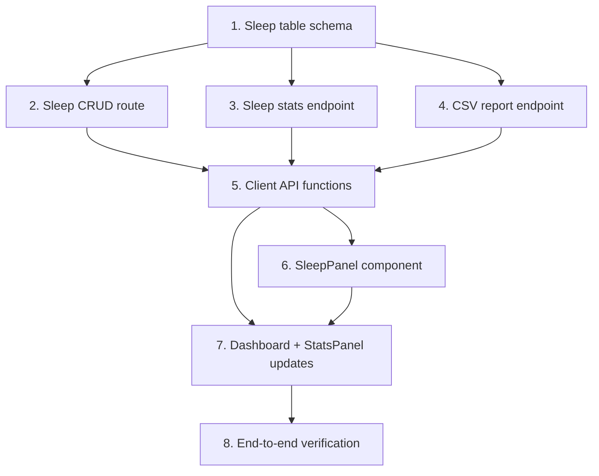

# Implementation Plan: Report Download and Sleep Tracking

## Overview

Add sleep tracking (CRUD + stats) and CSV report download to the Baby Tracker app. 8 tasks: DB schema, backend routes (sleep, stats, reports), frontend API layer, SleepPanel component, Dashboard/StatsPanel integration, and end-to-end verification.

## Tasks

- [x] 1. Add sleep table to database schema: Add `CREATE TABLE IF NOT EXISTS sleep` to `server/db.js` with columns id (TEXT PK), baby_id (TEXT NOT NULL FK), user_id (TEXT NOT NULL FK), start_time (TEXT NOT NULL), end_time (TEXT), duration_minutes (INTEGER), notes (TEXT), created_at (TEXT DEFAULT datetime('now')), with FOREIGN KEY constraints referencing babies(id) and users(id) with ON DELETE CASCADE.
- [x] 2. Create sleep CRUD route: Create `server/routes/sleep.js` implementing GET /:babyId (list, limit 50, sorted start_time DESC), POST /:babyId (create with validation: start_time required, end_time > start_time if provided, duration <= 1440 min, notes <= 500 chars, auto-calculate duration_minutes as Math.floor((end-start)/60000)), PATCH /:babyId/:sleepId (set end_time to close in-progress session, recalculate duration), DELETE /:babyId/:sleepId (ownership check). All routes use authenticateToken, verify baby ownership, try/catch DB errors. Register in server/index.js as app.use('/api/sleep', sleepRoutes).
- [x] 3. Add sleep stats endpoint: Add GET /sleep/:babyId to server/routes/stats.js returning aggregated sleep stats for period (days or from/to params), computing total_sessions, total_minutes, average_minutes_per_day (rounded 1 decimal), and daily breakdown array (date, session_count, total_minutes) sorted descending.
- [x] 4. Create CSV report endpoint: Create server/routes/reports.js with GET /:babyId that queries feedings, diapers, and sleep within optional days filter. Build RFC 4180 CSV with 3 sections (Feedings, Diapers, Sleep), each having section header row, column header row, data rows sorted timestamp DESC, sections separated by empty row. Set Content-Type text/csv and Content-Disposition attachment with filename {baby_name}_{start}_{end}.csv. Handle empty data (headers only), baby not found (404), DB errors (500). Register in server/index.js.
- [x] 5. Add sleep and report API functions to client: Add to client/src/api.js: getSleepRecords(babyId), addSleepRecord(babyId, data), updateSleepRecord(babyId, sleepId, data) using PATCH, deleteSleepRecord(babyId, sleepId), getSleepStats(babyId, {days}), downloadReport(babyId, {days}) that fetches as blob and triggers browser download.
- [x] 6. Create SleepPanel component: Create client/src/components/SleepPanel.jsx with form (start time datetime-local default now, optional end time, optional notes textarea max 500), client-side validation (end > start), recent records list showing start/end, duration as "Xh Ym", notes. Show "In Progress" badge with "End Now" button for null end_time records. Delete with inline confirmation pattern.
- [x] 7. Add Sleep tab to Dashboard and update StatsPanel: Add Sleep tab to Dashboard.jsx tabs, render SleepPanel when active. Update StatsPanel.jsx to fetch sleep stats, show sleep stat cards (avg min/day, total sessions), daily sleep breakdown table, and "Download Report" button with loading state, 30s timeout, error display.
- [x] 8. Verify all APIs end-to-end: Run test script covering sleep CRUD (valid create, no end_time, invalid times, >24h duration, list sorted, PATCH end session, delete), sleep stats (with/without data), report download (with/without days, empty, not found), auth checks. Verify client build compiles clean.

## Task Dependency Graph



```json
{
  "waves": [
    [1],
    [2, 3, 4],
    [5],
    [6],
    [7],
    [8]
  ]
}
```

## Notes

- Sleep duration computed server-side: `Math.floor((new Date(end_time) - new Date(start_time)) / 60000)`
- CSV uses RFC 4180 quoting: fields with commas/quotes/newlines wrapped in double quotes, internal quotes doubled
- Report download in frontend uses fetch blob approach (not JSON), triggers download via temporary anchor element
- PATCH endpoint only allows updating end_time (for ending in-progress sessions), not arbitrary field updates
